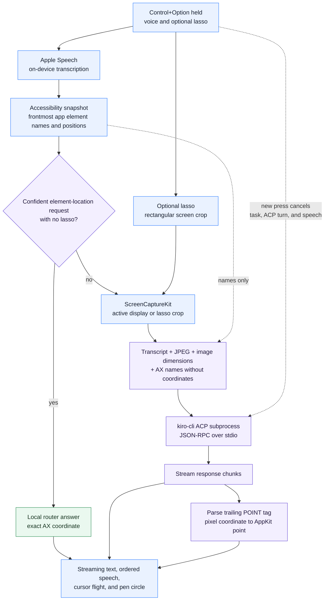

# OpenClicky

A voice companion for macOS that lives next to your cursor. Hold a hotkey,
ask about anything on your screen, and it answers out loud, in streaming text,
and by flying a little blue cursor over to point at things.

OpenClicky is local-first. Speech recognition runs on-device, speech output
runs on-device by default, and the AI brain is an agent CLI subprocess you
already have. The app holds no model-provider credentials. Optional Cartesia
or Deepgram speech uses keys you configure locally.

## What it does

- **Push-to-talk**: hold `ctrl + option` anywhere, speak, release. A waveform
  replaces the cursor buddy while you talk.
- **Sees your screen**: on release it captures the active display (downscaled,
  only while the key is held) and sends it to the agent with your question.
- **Answers three ways**: streaming text in a bubble that follows your cursor,
  spoken sentences that start playing while the rest is still generating, and
  a pointer flight: the blue triangle flies to the relevant UI element and
  sketches a hand-drawn circle around it.
- **Lasso a region**: while holding the hotkey, click-drag a loop around part
  of your screen. Only that region's bounding box is captured and your
  question is answered about exactly that area.
- **Instant local answers**: "where is the save button" never touches the
  agent. A deterministic router reads the frontmost app's accessibility tree
  and points at the exact coordinates in about 100 ms.
- **Copy the answer**: `ctrl + option + C` copies the last response.

## How it works



See [Architecture](docs/architecture.md) for the request lifecycle, component
ownership, cancellation behavior, trust boundaries, and coordinate spaces.

The agent brings its own auth and model access. A persistent session holds
conversation memory, so follow-ups just work. The app installs a dedicated
agent persona (`~/.kiro/agents/openclicky.json`) automatically: no tools, no
MCP servers, which keeps session startup fast and makes a spoken question
incapable of side effects.

## Requirements

- macOS 14.2 or later (ScreenCaptureKit)
- Xcode 15 or later
- [Kiro CLI](https://kiro.dev/cli/) installed and authenticated
  (`kiro-cli chat` should work in your terminal)

## Setup

```bash
git clone https://github.com/namanrajpal/OpenClicky.git
cd OpenClicky
open OpenClicky.xcodeproj
```

In Xcode: select the `OpenClicky` scheme, set your signing team under
Signing & Capabilities, and hit Cmd+R.

On first run the app lives in your menu bar. Open the panel from the blue
triangle icon and grant the four permissions it asks for: microphone,
speech recognition, accessibility, and screen recording. Screen recording
takes effect after relaunching the app once. Capture happens only while you
hold the hotkey.

### Optional: cloud text-to-speech

The default voice is the on-device system synthesizer. For a nicer voice,
create a `.env` file next to the project (it is gitignored):

```
CARTESIA_API_KEY=...        # Cartesia Sonic, default when present
DEEPGRAM_API_KEY=...        # Deepgram Aura, alternative
OPENCLICKY_TTS_PROVIDER=cartesia
```

Sentences fall back to the local voice automatically if a fetch fails.

## Controls

| Where | Action | Result |
|---|---|---|
| anywhere | hold `ctrl + option`, speak, release | ask about your screen |
| anywhere | click-drag while holding the hotkey | lasso a region for the question |
| anywhere | press the hotkey again mid-response | interrupt and ask something new |
| anywhere | `ctrl + option + C` | copy the last response |
| menu bar panel | agent picker | switch which agent answers |
| menu bar panel | respond with Voice + Text / Text only / Voice only | output preference |
| menu bar panel | show cursor buddy toggle | off = buddy appears only during interactions |

## Project layout

```
OpenClicky/
├── Core/                          portable core (no AppKit)
│   ├── ACPAgentClient.swift          agent subprocess, ACP JSON-RPC, streaming
│   ├── EnvFileLoader.swift            optional TTS configuration lookup
│   ├── QuestionRouter.swift           on-device vs agent routing rules
│   └── StreamingSentenceSplitter.swift  per-sentence TTS + tag holdback
├── CompanionManager.swift         central state machine and pipeline
├── OverlayWindow.swift            cursor buddy, pointing flight, pen circle, lasso stroke
├── CompanionResponseOverlay.swift streaming text bubble
├── AXTreeProvider.swift           accessibility tree extraction
├── LassoRegionSelectionController.swift  region-select drag capture
├── CompanionScreenCaptureUtility.swift   ScreenCaptureKit capture and crops
├── CloudSentenceTTSClient.swift   optional Cartesia / Deepgram voices
├── BuddyDictationManager.swift    mic pipeline and push-to-talk sessions
└── CompanionPanelView.swift       menu bar panel UI
```

More depth:

- [`docs/README.md`](docs/README.md): documentation map and reading paths
- [`docs/setup.md`](docs/setup.md): development setup and first-run checks
- [`docs/architecture.md`](docs/architecture.md): as-built architecture and data flow
- [`docs/reference/components.md`](docs/reference/components.md): component and internal API map
- [`docs/reference/configuration.md`](docs/reference/configuration.md): runtime configuration
- [`docs/UX-BASELINE.md`](docs/UX-BASELINE.md): shipped interaction model and UX decisions
- [`docs/plans/`](docs/plans/): roadmap and design sketches
- [`AGENTS.md`](AGENTS.md): coding-agent conventions and architecture summary

## Privacy

Nothing captures the screen in the background. A screenshot is taken only
for a submitted hotkey interaction, covers the active display or lasso region,
and is handed to the local `kiro-cli` process. The CLI uses its own configured
model provider. The app has no analytics or auto-updater. Optional cloud TTS
sends completed response sentences only when you configure provider keys.

## License

MIT. See [LICENSE](LICENSE).

OpenClicky grew out of [clicky](https://github.com/farzaa/clicky), an
MIT-licensed weekend experiment by Farza. It has since been completely
reworked around a different vision: local-first execution, a local agent
subprocess in place of cloud APIs, on-device routing, and region-scoped
capture. The license file carries the original copyright line alongside
the current one.
