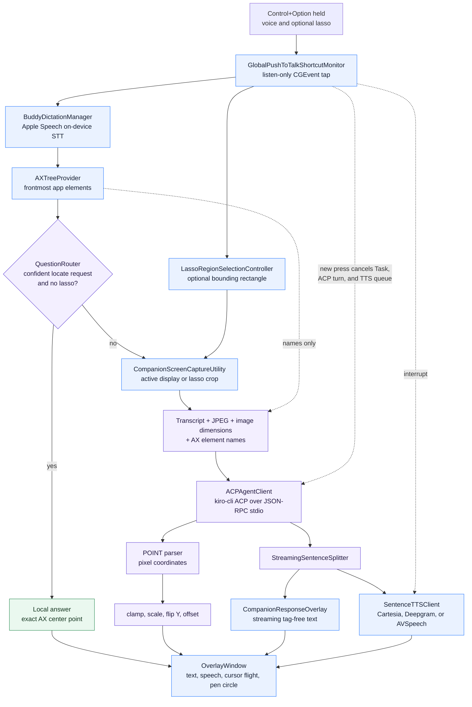

# OpenClicky Architecture

Status: as-built reference for the current Swift implementation.

OpenClicky is a menu-bar-only macOS app with a native AppKit/SwiftUI shell and a small platform-lean core. It accepts push-to-talk input, chooses a deterministic accessibility path or a screenshot-aware agent path, streams text and speech, and optionally flies the cursor buddy to a target.

## Source organization and architectural direction

```text
OpenClicky/
├── App/                  lifecycle, composition, and observable application state
├── Core/                 routing and stream-processing rules
├── Features/             user-facing voice, cursor-overlay, and menu-bar surfaces
├── Platform/             macOS Accessibility, capture, speech, shortcut, and permission adapters
├── Infrastructure/       ACP process transport and configuration loading
├── DesignSystem/         shared native visual tokens and controls
├── Resources/            asset catalog
├── Info.plist             app metadata and permission copy
└── OpenClicky.entitlements signing capabilities
```

The common architectural theme is a native shell around portable behavior:

```text
Features -> App -> Core
              |
              +-> Platform adapters
              +-> Infrastructure adapters
```

- **Features** render platform-native UI and forward user intent. They should not contain routing, protocol parsing, or capture policy.
- **App** is the composition root. It owns lifecycle and application state, and coordinates Core behavior with concrete adapters.
- **Core** owns deterministic rules and stream transformations. It must not import SwiftUI, AppKit, ScreenCaptureKit, AVFoundation, or other platform UI frameworks.
- **Platform** wraps operating-system capabilities such as Accessibility, capture, speech, shortcuts, permissions, and windows.
- **Infrastructure** wraps external processes, wire transports, and configuration sources.

The current Xcode target still compiles these folders as one Swift module, so the boundary is architectural rather than compiler-enforced. `QuestionRouter` still uses CoreGraphics geometry with AppKit-global semantics. A future package extraction should replace those values with platform-neutral point and rectangle types before claiming full Windows portability.

### Future Windows client

The Windows client should mirror the same shape with a native WinUI 3 shell:

```text
macOS Features + macOS Platform adapters
                    -> shared Core behavior and contracts <-
Windows Views/ViewModels + Windows Platform adapters
```

The reusable contract is the behavior and data model: routing rules, streaming semantics, annotation grammar, ACP message shapes, cancellation outcomes, and coordinate-conversion fixtures. macOS keeps SwiftUI/AppKit, Accessibility, ScreenCaptureKit, Apple Speech, and `NSPanel`; Windows supplies WinUI 3, UI Automation, Windows Graphics Capture, Windows input APIs, and its own speech and overlay implementations.

Swift and SwiftPM officially support Windows development, but the repository does not assume that C# will consume a Swift binary. Shared contracts and golden fixtures allow either a Windows-compatible Swift core or a small C# implementation to remain behaviorally equivalent.

References:

- [SwiftPM library structure](https://www.swift.org/getting-started/library-swiftpm/)
- [Swift platform support, including Windows](https://swift.org/platform-support/)
- [Microsoft WinUI 3 architecture patterns](https://learn.microsoft.com/en-us/windows/apps/develop/architecture-patterns)
- [Microsoft modern WinUI 3 app structure](https://learn.microsoft.com/en-us/windows/apps/develop/ui/windows-app-sdk-app-structure)

## System flow



## Runtime ownership

```text
OpenClickyApp
└── CompanionAppDelegate
    ├── CompanionManager                 central state and request orchestration
    │   ├── BuddyDictationManager        microphone and transcript lifecycle
    │   ├── GlobalPushToTalkShortcutMonitor
    │   ├── AXTreeProvider
    │   ├── LassoRegionSelectionController
    │   ├── ACPAgentClient
    │   ├── SentenceTTSClient
    │   ├── OverlayWindowManager
    │   └── CompanionResponseOverlayManager
    └── MenuBarPanelManager
        └── CompanionPanelView
```

`CompanionManager` is `@MainActor` and owns the user-visible voice state:

```text
idle -> listening -> processing -> responding -> idle
```

Pointing can run while the state returns to idle so the triangle remains visible during its flight.

## Request lifecycle

### 1. Press and capture

A Control+Option press cancels any previous response, ACP turn, and TTS playback. It enables lasso interaction on the overlay and starts microphone capture. Apple Speech receives `AVAudioPCMBuffer` values directly and requests on-device recognition where supported.

Releasing the shortcut ends the lasso, finalizes dictation, and submits the transcript. The lasso controller returns a rectangular bounding box only when the drag has enough points and is at least 24 points in each dimension.

### 2. Route before capture

`AXTreeProvider` snapshots the frontmost app. `QuestionRouter` handles short locate phrases such as “where is the save button?” when one accessible element matches confidently and no lasso region exists.

The local path:

1. Uses the accessible element's exact AppKit-global center point.
2. Produces a short canned answer.
3. Applies the current text and voice modality preferences.
4. Starts the cursor flight immediately.
5. Skips screenshot capture and the ACP agent.

Ambiguous matches, visual questions, general questions, missing AX data, and every lasso request use the agent path.

### 3. Capture and prompt

The agent path captures one image:

- A lasso crop when a region was selected.
- Otherwise the active display under the cursor.

ScreenCaptureKit output is downscaled to a maximum dimension of 1280 pixels. Capture metadata records the actual `CGImage` pixel dimensions, the corresponding display size in points, and the AppKit-global display frame.

The prompt contains:

- The transcript.
- Image labels with actual pixel dimensions.
- JPEG image blocks.
- Up to 3,000 characters of AX element names from the frontmost app.

AX coordinates are intentionally excluded from agent context. The model estimates screenshot-pixel coordinates from the image and uses AX names only for precise labels.

### 4. ACP session and streaming

`ACPAgentClient` starts `kiro-cli acp --agent openclicky` and speaks newline-delimited JSON-RPC 2.0 over stdin/stdout. Startup performs `initialize` followed by `session/new`. A single session remains alive for follow-up context.

Each `session/update` text chunk is accumulated. `StreamingSentenceSplitter`:

- Holds back incomplete trailing POINT tags.
- Updates the cursor-following text bubble with tag-free text.
- Emits completed sentences for TTS while later text is still arriving.

See [kiro-cli reference](reference/kiro-cli.md) for the verified wire shapes.

### 5. Speech output

`SentenceTTSClient` provides ordered per-sentence playback. `CloudSentenceTTSClient` starts sentence fetches concurrently and plays the results in enqueue order. Any failed cloud sentence uses `LocalSpeechSynthesizerTTSClient` for that sentence.

A generation counter invalidates late cloud responses after interruption.

### 6. Pointing

The agent can end a response with a POINT tag. The parser removes the tag from visible and spoken text, then maps screenshot pixels into AppKit-global coordinates. See [Annotation protocol](reference/annotation-protocol.md).

`BlueCursorView` converts the global point into its per-display SwiftUI coordinate space, flies along a quadratic Bezier path, and draws `PenCircleShape` around the target.

## Coordinate spaces

| Space | Origin | Used by |
|---|---|---|
| AppKit global points | bottom-left | mouse location, `NSScreen.frame`, lasso, AX router targets, final point |
| CoreGraphics global points | top-left | ScreenCaptureKit and raw AX positions |
| Screenshot pixels | top-left | JPEG images and agent POINT coordinates |
| SwiftUI overlay points | top-left within one display | buddy rendering and animation |

Agent POINT conversion is:

1. Clamp X and Y to the actual screenshot dimensions.
2. Scale screenshot pixels to display points.
3. Flip Y from top-left to bottom-left origin.
4. Add the capture frame's AppKit-global origin.

Region capture sets its `displayFrame` to the crop rectangle, allowing the same mapping pipeline to work for full-display and lasso images.

## Interruption and recovery

A new push-to-talk press coordinates three cancellation mechanisms:

1. Cancel the Swift `currentResponseTask`.
2. Send ACP `session/cancel` for the active prompt.
3. Stop TTS and increment its playback generation.

The current ACP session is warmed at app startup. If the subprocess fails, a later prompt can start a new process and session. Session history restoration through ACP `session/load` is not implemented.

## Network and trust boundaries

- Apple Speech and the deterministic AX route run on-device.
- Screen images are sent to the local `kiro-cli` process. The CLI uses its own authentication and configured model provider, which can involve network traffic.
- Optional Cartesia or Deepgram TTS sends completed response sentences to the selected provider.
- The generated OpenClicky agent has `tools: []`, no MCP servers, and rejects permission requests defensively.
- The app contains no analytics or update service.

## Related references

- [Components and internal APIs](reference/components.md)
- [Configuration](reference/configuration.md)
- [Annotation protocol](reference/annotation-protocol.md)
- [UX baseline](UX-BASELINE.md)
